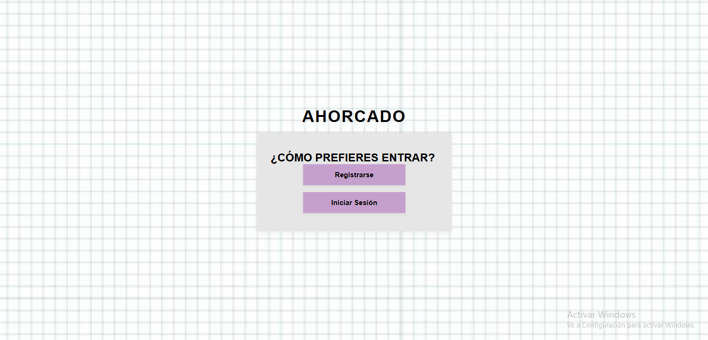
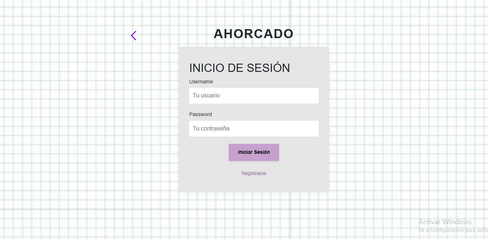
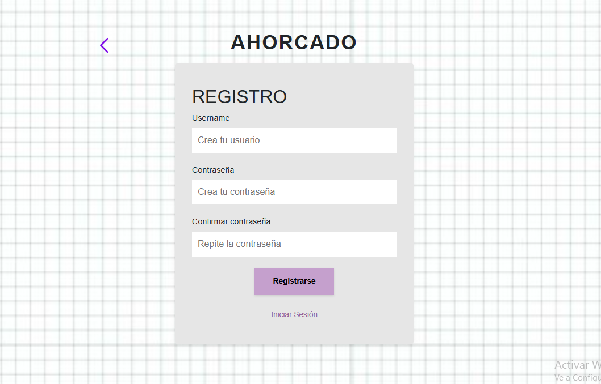
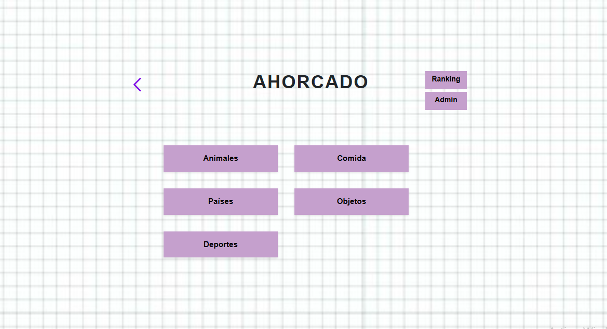
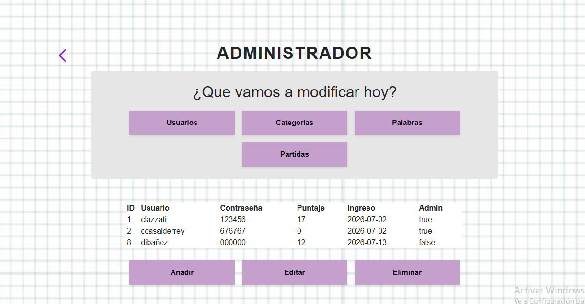
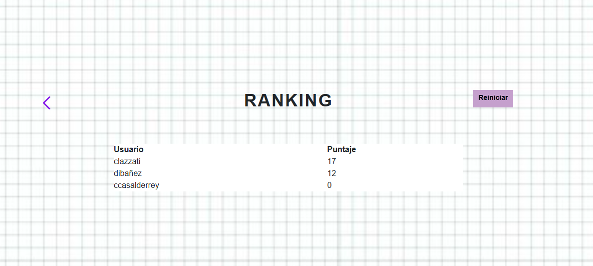
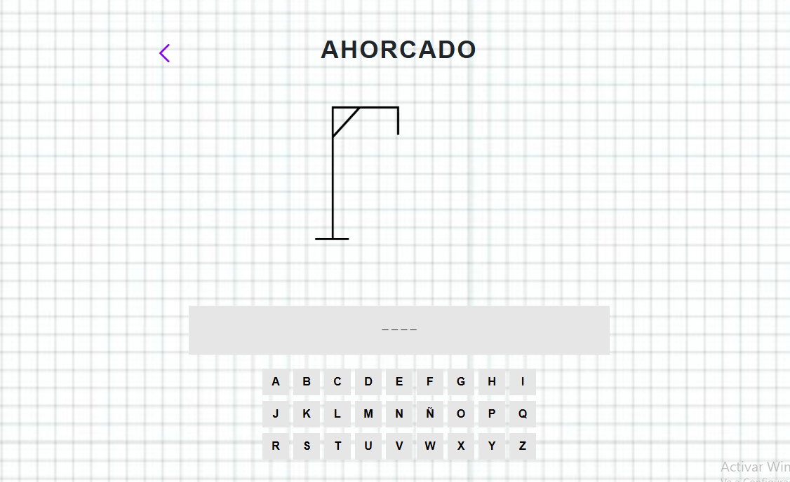
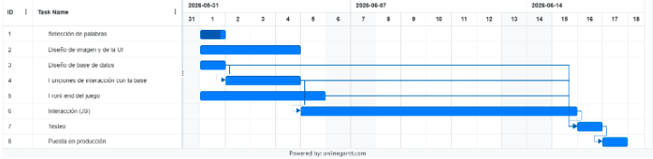

# 2026_TPIN1_G16
# Presupuesto del Proyecto – Juego del Ahorcado - TPI N°1

### Grupo
- **Grupo:** 16
- **División:** 5ºB

### Integrantes
- Catalina Lazzati
- Rosario Flores
- Delfina Ibañez
- Carolina Casalderrey

---

# Descripción de la propuesta

Queremos desarrollar un juego del ahorcado que esta dividido por categorias, cada una con sus palabras.

Cada palabra tiene un valor segun su dificultad: 6 puntos si es facil, 12 si es medio y 18 si es dificil. Por cada letra incorrecta ingresada por el jugador se descontará puntos, tambien dependiendo de la dificultad: 1 si es facil, 2 si es medio y 3 si es dificil. En caso de no adivinar la palabra, no se obtendrá ningún punto. Los puntos se guardan asi despues se puede ver un ranking de los jugadores.

---

# Bocetos de la interfaz

## Inicio

## Login

## Registro

## Selección de categorías

## Pagina de admin

## Ranking

## Juego

---

# Alcance

- Categorias (5 iniciales, el admin puede añadir más).
- Muchas palabras divididas por dificultad.
- Almacenamiento de palabras, jugadores, categorias y partidas en una base de datos.
- Ranking de jugadores.
- Administración y agregado de palabras y categorias.

---

# Tareas

1. Selección de palabras.
2. Diseño de la imagen y de la interfaz de usuario.
3. Diseño de la base de datos.
4. Desarrollo de las funciones de interacción con la base de datos.
5. Desarrollo del Front-end (HTML y CSS).
6. Desarrollo de la interacción utilizando JavaScript.
7. Testeo del sistema.
8. Puesta en producción.

---

# Responsabilidades
- Rosario Flores - Tareas 1 y 5
- Catalina Lazzati - Tareas 2 y 6
- Carolina Casalderrey - Tareas 3 y 7
- Delfina Ibañez - Tareas 4 y 8

---

# Diagrama de Gantt

---

## Entregables

### Primer entregable – Login y Registro
- Registro de nuevos usuarios.
- Inicio de sesión.
- Cierre de sesión.
- Validación de datos ingresados.
- Agregar usuarios en la base de datos.
- Navegación entre paginas principales.
- Diseño inicial de la interfaz.

### Segundo entregable – Administrador y Ranking
- Panel de administración.
- Añadir, editar y eliminar jugadores.
- Añadir, editar y eliminar categorías.
- Añadir, editar y eliminar palabras.
- Añadir, editar y eliminar partidas.
- Ranking de jugadores ordenado por puntaje.
- Reinicio del ranking (solo administradores).
- Restricción de acceso a funciones de administrador.

### Entrega final – Juego
- Selección de categoría.
- Validación de que la palabra no fue jugada antes por el usuario.
- Desarrollo completo del juego del ahorcado.
- Actualización de la imagen del ahorcado según la cantidad de errores.
- Ingreso y validación de letras.
- Cálculo del puntaje según los intentos fallidos y la dificultad de la plabra.
- Registro de las partidas jugadas en la base de datos.
- Paso automático a la siguiente palabra.
- Modales de victoria y derrota.
- Corrección de errores y pruebas finales.